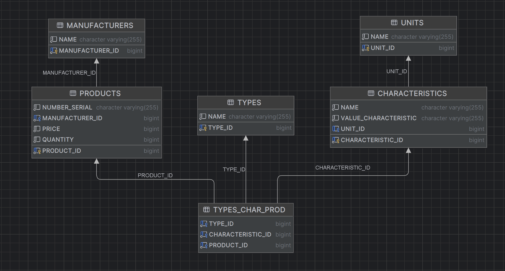

# ComputersStore
**Программа предназначена учета товара в компьютерном магазине.**

**Возможности программы:**
- добавление товара;
- редактирование товара;
- получение товара по идентификатору;
- получение всех товаров;
- получение всех товаров конкретного типа;
- удаление товара по идентификатору;
- удаление всех товаров.

**Используемые стек: Java 17, Spring Boot, Spring Data JPA, Maven, H2**

Схема БД представлена ниже.
>

Данные для тестирования в Postman:
[ComputerStoreTest](https://github.com/mikhailovPI/ComputersStore/blob/main/ComputersStore/info/ComputerStore.postman_collection.json)
