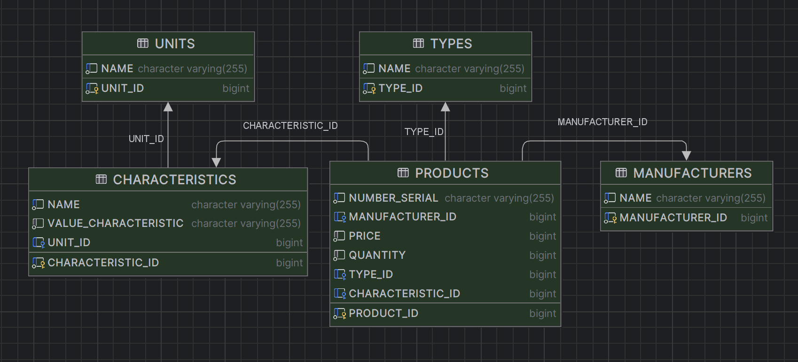

# Computers Store
**Программа предназначена для учета компьютерной техники.**

<u>***Возможности программы:***</u>
- добавление товара;
- редактирование товара;
- получение товара по идентификатору;
- получение всех товаров;
- получение всех товаров конкретного типа;
- удаление товара по идентификатору;
- удаление всех товаров.

**Используемый стек: Java 17, Spring Boot, Spring Data JPA, Maven, H2**

<u>***Для запуска приложения необходимо:***</u>
- Склонировать репозиторий на ПК в необходимую папку;
- Создать БД со следующими свойствами 
(user, password см. в [application.properties](https://github.com/mikhailovPI/ComputersStore/blob/main/ComputersStore/src/main/resources/application.properties)):

>

- Проверить в [application.properties](https://github.com/mikhailovPI/ComputersStore/blob/main/ComputersStore/src/main/resources/application.properties) 
способ записи данных (jdbc:h2:mem / jdbc:h2:./db);
- При хранении данных в БД запустить файл [schema.sql](https://github.com/mikhailovPI/ComputersStore/blob/main/ComputersStore/src/main/resources/schema.sql);
- Произвести запуск приложения (class ComputersStoreApplication);
- Запустить Postman на [localhost:8080](http://localhost:8080);
- Запустить коллекцию [тестов](https://github.com/mikhailovPI/ComputersStore/blob/main/ComputersStore/info/ComputerStore.postman_collection.json) в Postman;

***Схема базы данных:***
>

***Данные для тестирования в Postman:***
[tests](https://github.com/mikhailovPI/ComputersStore/blob/main/ComputersStore/info/ComputerStore.postman_collection.json)
